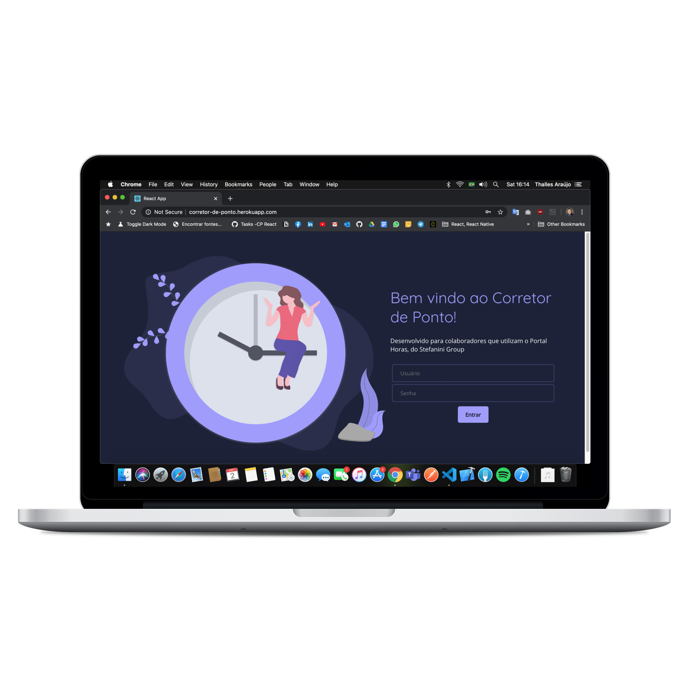
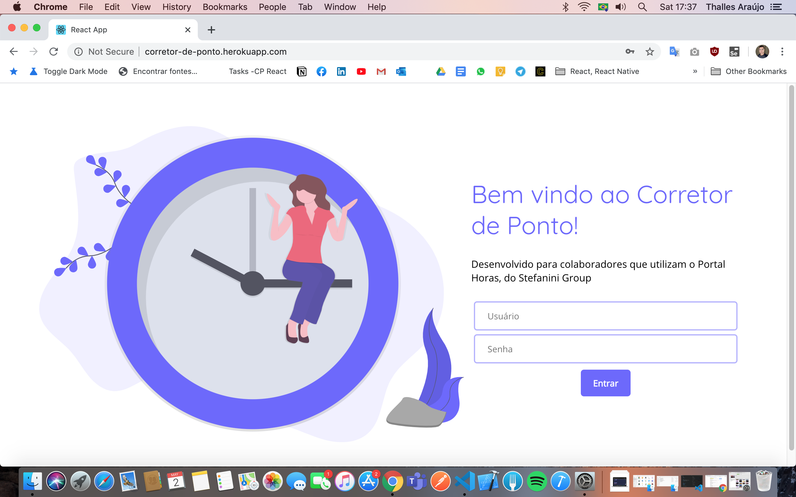
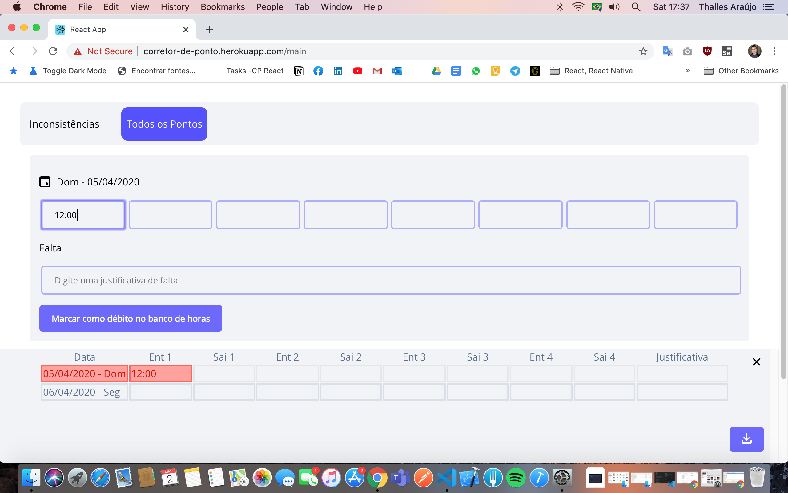
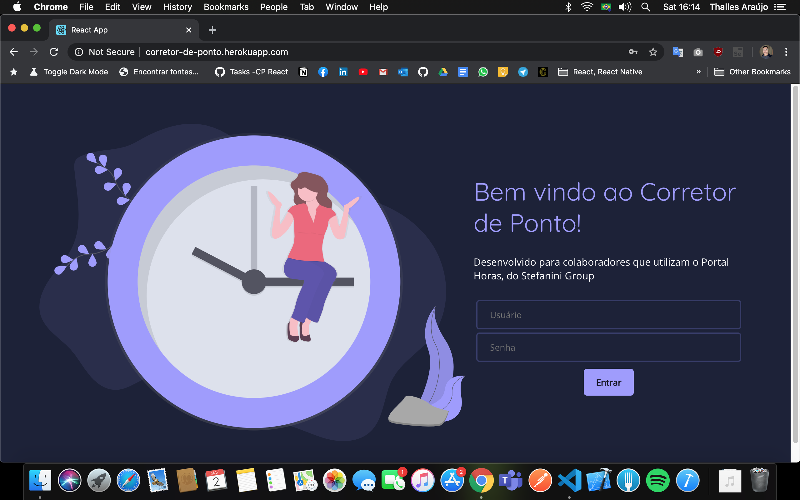
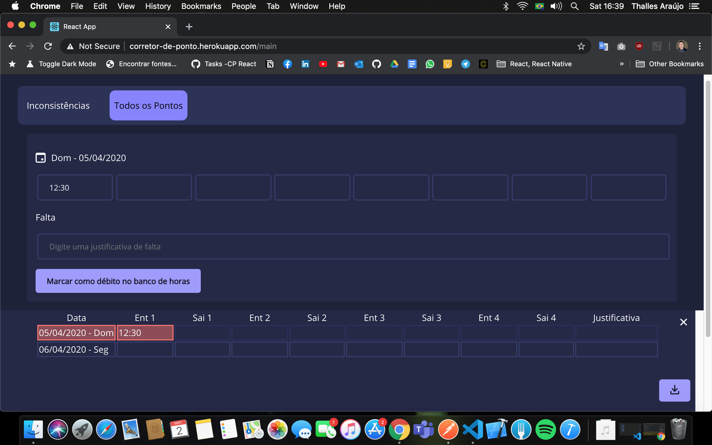

# Corretor de Ponto (Versão React)

Aplicação para correção de ponto do Portal Horas (Stefanini Group) desenvolvida em React

## Features

- Exportação do ponto editado para PDF
- Login utilizando as credenciais do Portal Horas
- Modos claro e escuro

## Telas (Modo Claro)

## Telas (Modo Escuro)

## Sugestões e relatórios de bug

Para sugestões ou relatar um bug, os seguintes canais podem ser utilizados:

(Lembre-se de verificar se a sua questão já está cadastrada na lista no Issue Tracker antes de relatá-la)

* [Issue Tracker](https://github.com/ThallesAraujo/corretorPontoReact/issues)

* [E-mail Pessoal](mailto:thalleshenrique.na@gmail.com)

